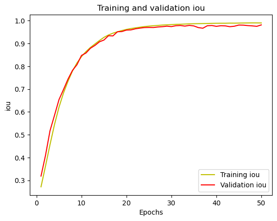

# **NeuroSeg3D: 3D Attention U-Net for Accurate Brain Tumor Segmentation (BraTS2021)**

## **Overview**
This project introduces **NeuroSeg3D**, a sophisticated 3D U-Net architecture enhanced with **residual blocks** and **spatial attention** modules to capture fine spatial features from MRI images.

### **Sample Brain MRI Slices with Ground Truth & Prediction**
The dataset used in this project is the [**BraTS 2021 dataset**](https://www.kaggle.com/datasets/dschettler8845/brats-2021-task1) from kaggle. Here is a visual representation of the brain MRI slices alongside the ground truth mask:

## **Model Architecture**

Our **NeuroSeg3D** is based on the 3D U-Net, enhanced with:
- **Residual Blocks** for improved feature propagation and network depth
- **Spatial Attention** to focus on relevant spatial features
- **Channel Attention** and **CBAM** examined as alternative attention mechanisms

This combination allows the network to capture both global and local context, essential for accurate segmentation in medical imaging.

### **Training Curves**
The training process was stable, with smooth convergence, indicating effective learning and no signs of overfitting.

| Dice Loss Curves | Dice Score Curves | IoU Score Curves |
|------------------------------|------------------------------|------------------------------|
|       |      |        |

### **Quantitative Results**
The following table summarizes the performance (%) of the model on the validation and test sets:

| Metric          | Validation Set | Test Set    |
|-----------------|----------------|-------------|
| **Mean Dice**   | 84.42          | 83.93       |
| **Mean IoU**    | 75.86          | 74.84       |

The **NeuroSeg3D**, augmented with spatial attention, proved to be highly effective in segmenting brain tumors from MRI images. The model achieved robust results across multiple metrics, demonstrating strong generalization capabilities. 
